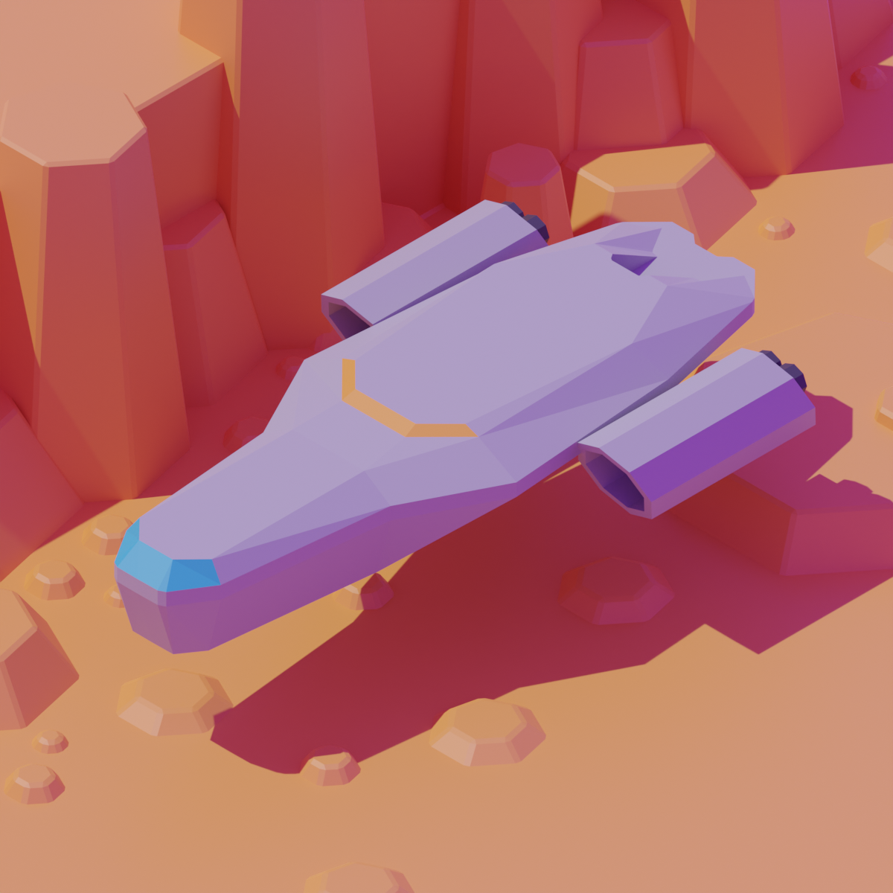
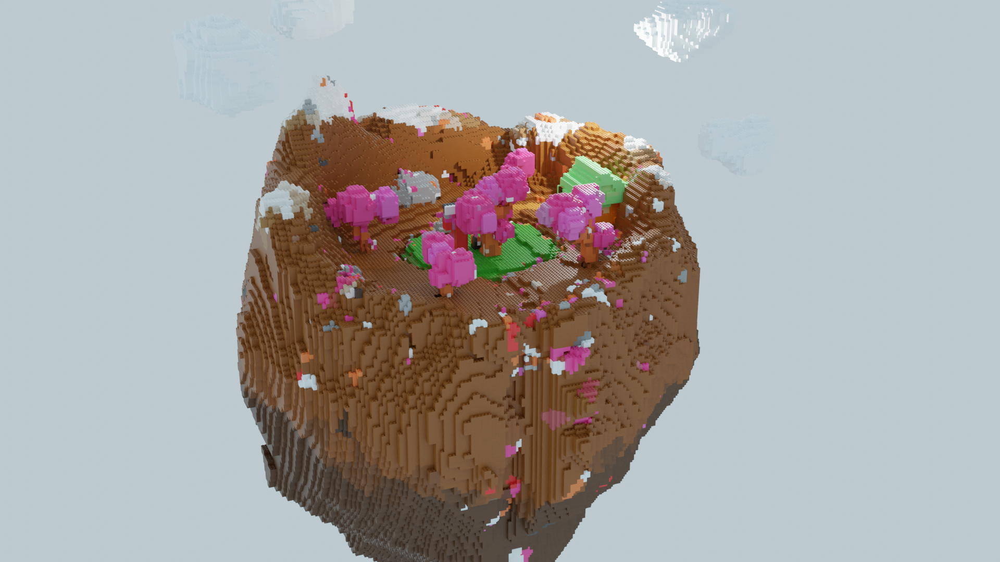
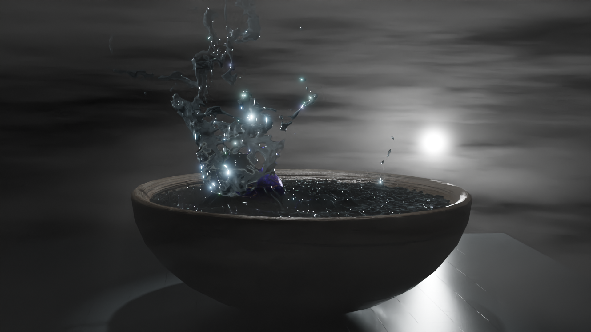
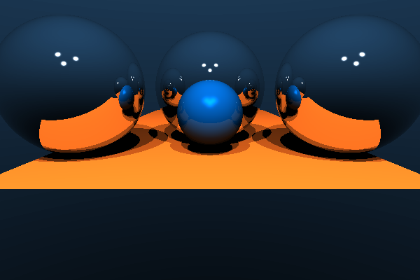
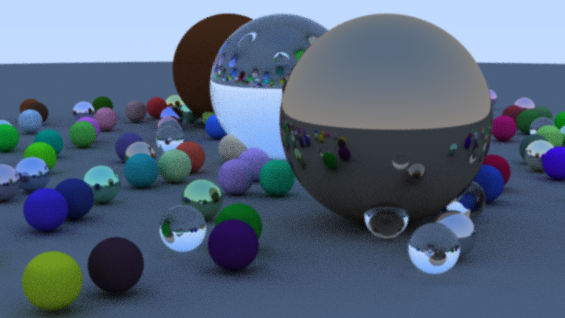
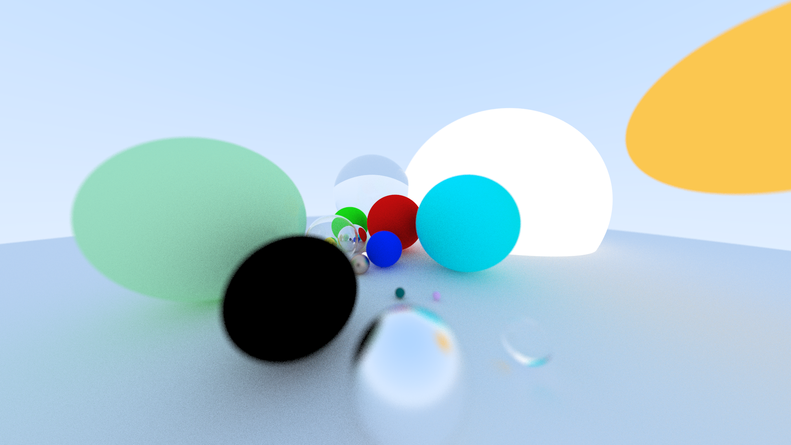
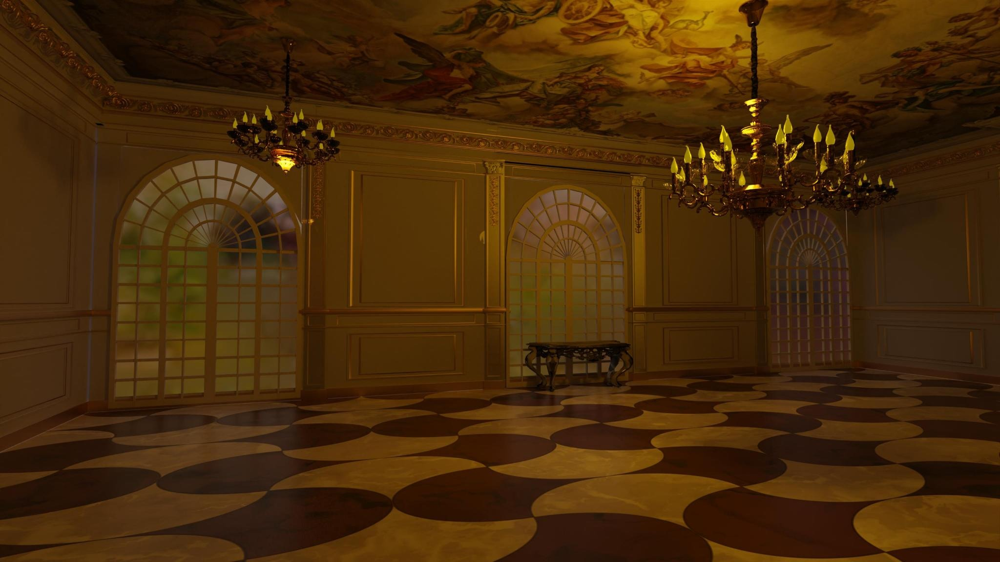

## About:

Introduction to Computer Graphics course made for DHBW, Mannheim, Winter/Spring 2023.

This course is mostly based on:
* Scratchapixel: https://www.scratchapixel.com/
* PBRT: https://pbrt.org/
* Real-Time-Rendering Book: https://www.realtimerendering.com/

## Amazing projects done by students

* Ray-tracing with GLTF support using Rust: https://github.com/precompiledB/rei

* Blender modeling, animation and rendering: https://drive.google.com/drive/folders/1GCEoIqOUJ-KyT1ON3Yw87Xno3CoE5PDo

* Blender modeling, animation and rendering: https://github.com/Sandario/VaseOnTable

* Ray-tracing in Rust with CLI and configuration support: https://github.com/0x6e66/raytracer

* Ray-tracing: https://github.com/Code-Addiction/Project_Raytracing_Renderer

* Ray-tracing: https://gitlab.com/simon-sp/raytracing

* Ray-tracing: https://github.com/EinePriseCode/Rendering

* 2.5D rendering engine with features: https://github.com/0x7477/2.5D-Engine
* Blender modeling: https://drive.google.com/drive/folders/15nLf2M1pDCEnkyPPuoP1sZsRVdAYcbPG

## News and updates for lectures:

**Exam:** 29.3.2023., 16h, Raum 136.1B

**Project deadline:** 8.4.2023., 23:59h

* 1.2.2023. [document](https://github.com/lorentzo/IntroductionToComputerGraphics/tree/main/news/1_news_1_2_2023)
  * Grading, Projects, Exam, Errata, Email
  * 3D cloth, 3D characters, path and ray tracing

* 8.2.2023. [document](https://github.com/lorentzo/IntroductionToComputerGraphics/tree/main/news/2_news_8_2_2023)
  * New exam date (29.3.2023., 16h, Raum 136.1B), exam questions
  * Project documentation guidelines

* 15.2.2023. [document](https://github.com/lorentzo/IntroductionToComputerGraphics/tree/main/news/3_news_15_2_2023)
  * New exam date (29.3.2023., 16h, Raum 136.1B)
  * Project deadline: 8.4.2023.
  * Homogeneous coordinates and look-at matrix and camera rays generation

* 22.2.2023. [document](https://github.com/lorentzo/IntroductionToComputerGraphics/tree/main/news/4_news_22_2_2022)
  * Exam date reminder: 29.3.2023., 16h, Raum 136.1B
  * Project reminder: 8.4.2023.

* 1.3.2023. [document](https://github.com/lorentzo/IntroductionToComputerGraphics/tree/main/news/5_news_1_3_2023)
  * height maps, texture atlas, ptex, camera lens

* 8.3.2023. [document](https://github.com/lorentzo/IntroductionToComputerGraphics/tree/main/news/6_news_8_3_2023)
  * perspective problems, XYZ colorspace

* 22.3.2023. [document](https://github.com/lorentzo/IntroductionToComputerGraphics/tree/main/news/7_22_3_2023)
  * Lecture evaluation
  * Exam reminder: 29.3.2023., 16h, Raum 136.1B
  * Project reminder: 8.4.2023., 23:59h

* 29.3.2023. [document](https://github.com/lorentzo/IntroductionToComputerGraphics/tree/main/news/8_29_3_2023)
  * Clipping, look at transform, hair modeling
  * Project reminder: 8.4.2023., 23:59h

## Lectures

### 1. Introduction

* Computer graphics: what and why
* Glimpse of image synthesis
* Course organization

[Introduction lecture presentation](https://github.com/lorentzo/IntroductionToComputerGraphics/tree/main/lectures/1_introduction)

[Introduction lecture questions](https://github.com/lorentzo/IntroductionToComputerGraphics/tree/main/lectures/1_introduction)

### 2. Overview of image generation

Pillars of image generation
* 3D scene
* Rendering algorithm
* Image and display

[Overview of image generation lecture presentation](https://github.com/lorentzo/IntroductionToComputerGraphics/tree/main/lectures/2_overview_computer_image_generation)

[Overview of image generation lecture questions](https://github.com/lorentzo/IntroductionToComputerGraphics/tree/main/lectures/2_overview_computer_image_generation)

### 3. 3D scene overview

Foundational elements of 3D scene:
* 3D objects
  * Shape representation
  * Material
* Light sources
* Cameras

[3D scene overview lecture presentation](https://github.com/lorentzo/IntroductionToComputerGraphics/tree/main/lectures/3_3d_scene_overview)

[3D scene overview lecture questions](https://github.com/lorentzo/IntroductionToComputerGraphics/tree/main/lectures/3_3d_scene_overview)

### 4. Transforms

* 3D space
* Transformations
* Scene organization

[Transforms lecture presentation](https://github.com/lorentzo/IntroductionToComputerGraphics/tree/main/lectures/4_transforms)

[Transforms lecture questions](https://github.com/lorentzo/IntroductionToComputerGraphics/tree/main/lectures/4_transforms)

### 5. 3D objects: mesh shape representation

* Polygon mesh
* Subdivision surfaces
* Mesh and rendering
* Mesh data-structures
* Mesh modeling and acquisition

[3D objects: mesh lecture presentation](https://github.com/lorentzo/IntroductionToComputerGraphics/tree/main/lectures/5_mesh)

[3D objects: mesh lecture questions](https://github.com/lorentzo/IntroductionToComputerGraphics/tree/main/lectures/5_mesh)

### 6. 3D objects: parametric curves and surfaces, implicit surfaces

* Parametric curves
* parametric surfaces
* Implicit surfaces

[3D objects: parametric curves and surfaces, implicit surfaces presentation](https://github.com/lorentzo/IntroductionToComputerGraphics/tree/main/lectures/6_parametric_curves_surfaces)

[3D objects: parametric curves and surfaces, implicit surfaces questions](https://github.com/lorentzo/IntroductionToComputerGraphics/tree/main/lectures/6_parametric_curves_surfaces)

### 7. 3D Objects: material

* Material observation
* Physics (optics) models for CG
* Material models in CG
  * Scattering models

[3D objects: material lecture presentation](https://github.com/lorentzo/IntroductionToComputerGraphics/tree/main/lectures/7_material)

[3D objects: material lecture questions](https://github.com/lorentzo/IntroductionToComputerGraphics/tree/main/lectures/7_material)

### 8. 3D Objects: texture

* Texturing pipeline
* Image and procedural textures
* Texture and material modeling

[3D Objects: texture lecture presentation](https://github.com/lorentzo/IntroductionToComputerGraphics/tree/main/lectures/8_texture)

[3D Objects: texture lecture questions](https://github.com/lorentzo/IntroductionToComputerGraphics/tree/main/lectures/8_texture)

### 9. Light

* Light and color
* Real-world light sources
* Light models
  * Physical lights
  * Non-physical lights
  * Environment illumination
* Shadows

[Light lecture presentation](https://github.com/lorentzo/IntroductionToComputerGraphics/tree/main/lectures/9_light)

[Light lecture questions](https://github.com/lorentzo/IntroductionToComputerGraphics/tree/main/lectures/9_light)

### 10. Camera

* Real camera system
* Image formation
* Pinhole camera model
* Virtual pinhole camera

[Camera lecture presentation](https://github.com/lorentzo/IntroductionToComputerGraphics/tree/main/lectures/10_camera)

[Camera lecture questions](https://github.com/lorentzo/IntroductionToComputerGraphics/tree/main/lectures/10_camera)

### 11. Rendering overview

* Rendering big picture
* Practical rendering
  * Ray-tracing
  * Rasterization
* Intuition via ray-tracing

[Rendering overview lecture presentation](https://github.com/lorentzo/IntroductionToComputerGraphics/tree/main/lectures/11_rendering_overview)

[Rendering overview lecture questions](https://github.com/lorentzo/IntroductionToComputerGraphics/tree/main/lectures/11_rendering_overview)

### 12. Rendering: ray-tracing

* Ray-tracing overview
* Camera rays
* Intersections (visibility)
* Shading
* Light transport

[Rendering: ray-tracing lecture presentation](https://github.com/lorentzo/IntroductionToComputerGraphics/tree/main/lectures/12_rendering_raytracing)

[Rendering: ray-tracing lecture questions](https://github.com/lorentzo/IntroductionToComputerGraphics/tree/main/lectures/12_rendering_raytracing)

### 13. Rendering: rasterization

* Rasterization: the visibility solution core
* Graphics rendering pipeline: using rasterization for rendering
* Graphics rendering pipeline: logical GPU model, API

[Rendering: rasterization lecture presentation](https://github.com/lorentzo/IntroductionToComputerGraphics/tree/main/lectures/13_rendering_rasterization)

[Rendering: rasterization lecture questions](https://github.com/lorentzo/IntroductionToComputerGraphics/tree/main/lectures/13_rendering_rasterization)

### 14. Image

* Image-space effects
* Digital imagery
* Aliasing and anti-aliasing
* Scene to screen

[Image lecture presentation](https://github.com/lorentzo/IntroductionToComputerGraphics/tree/main/lectures/14_image)

### 15. Animation (Optional)

* Traditional animation in computer graphics
* Procedural animation
  * Physically-based
  * Empirical

### Advanced topics (Optional)

[More on 3D scene](https://github.com/lorentzo/IntroductionToComputerGraphics/tree/main/lectures/15_more_3d_scene)
* Voxels

[More on rendering](https://github.com/lorentzo/IntroductionToComputerGraphics/tree/main/lectures/16_more_rendering)
* Light transport for global illumination:
  * Monte-Carlo ray-tracing: path-tracing, bidirectional path-tracing, metropolis light transport, importance sampling, light sampling, BRDF sampling
  * Finite elements methods: radiosity
* Light transport for volumetric media: participating media and sub-surface-scattering

[More on image](https://github.com/lorentzo/IntroductionToComputerGraphics/tree/main/lectures/17_more_images)

### Outro

* Review
* Where to next?

[Outro presentation](https://github.com/lorentzo/IntroductionToComputerGraphics/tree/main/lectures/outro)

## Projects

### Ray-tracing based rendering from scratch

[Project task and guide](https://github.com/lorentzo/IntroductionToComputerGraphics/tree/main/projects/renderer_ray_tracing)

### Rasterization-based rendering, animation and interaction in three.js

[Project task and guide](https://github.com/lorentzo/IntroductionToComputerGraphics/tree/main/projects/renderer_rasterization)

### Modeling and animation in Blender

[Project task and guide](https://github.com/lorentzo/IntroductionToComputerGraphics/tree/main/projects/modeling_animation)

## Additional learning material

[Wiki](https://github.com/lorentzo/IntroductionToComputerGraphics/wiki)
